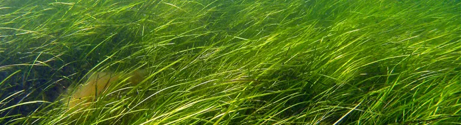

```{r setup, include=FALSE}
knitr::opts_chunk$set(echo = FALSE)
```

## Submerged aquatic vegetation (SAV) needs clear water to survive

- Water clarity can be measured by the light attenuation coefficient (KD)
- The higher the KD, the more turbid the water
- Marine SAV typically needs a seasonal median KD of less than 0.75 to 1.5 per meter to grow to depths of 1 to 2 m
- However, some interannual variability is expected, and seagrass can recover from periodic years of somewhat lower light

{width=100%}


## Purpose of App

This app assists water quality managers in setting reasonable water clarity targets for the protection of SAV. Ideally, targets should be set so that:

- The failure probability for a site known to be healthy is not more than 10%
- The failure probability for a site known to be unhealthy is not less than 80%

## User Inputs

- A maximum magnitude of the median seasonal light attenuation coefficient
- A maximum allowable exceedance frequency (e.g., once every three years)
- The probability of missing the target in any one year
- Optionally, users can upload a file with data on seasonal median KD at a known site

## Output: Probability that a site will fail the target

- Binomial statistics are used to predict the probability of failure over a multi-year assessment period, which is usually 3 to 5 years. For example:

```{r binomial, echo = TRUE}
k <- 1            ## Allowable no. of exceedances in the assessment period
z <- 5            ## Length of assessment period in years  
p_1 <- 0.2          ## Probability of exceedance in any one year
p_assessment <- (1 - pbinom(k, z, p_1)) * 100 
print(paste("The probability that the site fails is", p_assessment, "%"))
```
- Users can adjust the target magnitude or frequency to obtain reasonable regulatory targets
